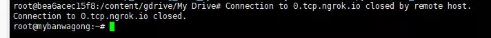
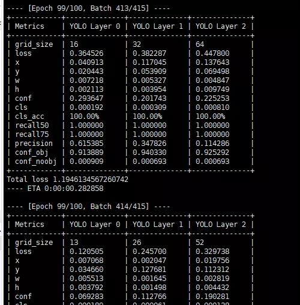

# 一、Google-Colab_ngrok

:droplet: Google Colab进阶操作-把colab用ngrok代理为自己的远程服务器

# 二、使用

虽然 Colab 提供 GPU 算力，但是有一个特别坑的地方就是经常掉线，而且网络特别不稳定。

我们一般是用 GPU 算力来训练模型的，所以要是能把 Colab 变成一个终端就更香了

以下，我们就把 Colab 通过 `ngrok` 代理，将 Colab 变成一台远程服务器

`ngrok` 是一个反向代理，通过在公共端点和本地运行的 Web 服务器之间建立一个安全的通道，实现内网主机的服务可以暴露给外网。

### 1. 打开下面这一个网站

```html
https://colab.research.google.com/github/imadelh/comments/blob/master/CUDA_GPU-server.ipynb
```
或者 [直接下载](https://github.com/WangRongsheng/Google-Colab_ngrok/archive/master.zip)

### 2. 按照代码一步一步运行

中间可能会出现一些授权操作，比如授权你的网盘，这样你可以使用网盘来存储训练数据（15G） 基本够用


上面显示的 T4，若不是 T4 可以多次断开 `Colab` 重新连接，再运行代码

下面红框中是随机生成的密码，待会会用到


### 3. 授权 ngrok

运行到以下程序部分时，会有一个跳转连接，点击它会跳转到 `ngrok` 的网站，首次使用可能需要注册，但是我们使用 `Google 账号` 进行登录。

生成授权码，直接复制就行了


将授权码输入到输入框，点击回车就行了


### 4. 用终端登录 Colab

待上面运行结束以后，会出现一个链接


点击以后，会跳转到这个界面，记住下面这个端口号


### 5. Xshell 登录

考虑到 `FW` 的存在，我使用的是远程服务器（Ubuntu 系统）进行登录

```html
# 登录  port 就是上面那个端口号
ssh root@0.tcp.ngrok.io -p [port]
```

第一次登录要你输一个*yes*  ，输入以后，复制上面生成的密码，复制到终端回车就行了（在终端是不会显示输入的密码的）

出现最下面的那个红框中相似的内容就证明成功了


### 6. 查看 GPU 详情

```html
# 查看 GPU 配置
export LD_PRELOAD=/usr/lib64-nvidia/libnvidia-ml.so  # 运行一次这个就行了
nvidia-smi
```

### 7. 使用网盘数据

上面有一步是授权网盘的，网盘的数据的路径如下：

```html
cd content/gdrive/My\ Drive/
```


# 三、总结

通过上面的一顿操作，我们就拥有了一台属于自己的 GPU 服务器，不过，虽然可以免费使用 GPU，但是时长掉线的问题依然存在，掉线就需要重连，再次运行 `ssh root@0.tcp.ngrok.io -p [port]` 输入密码即可，还有一种情况是，长时间没有操作，服务器就会挂掉，这时，就算你再运行  `ssh root@0.tcp.ngrok.io -p [port]`

也是没用的，这时只能再根据上面的操作运行一遍。



不过，如果你训练模型的话，终端会一直刷新，这样服务器就不会断掉。同时，你训练模型的话需要一定时间保存一次模型，以防万一。




